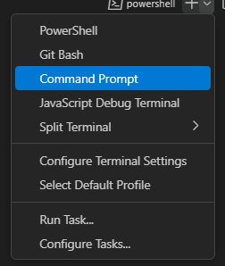

##### Steps to run -
- Clone the repo and navigate to the diretory.
- Download the [dataset](https://www.kaggle.com/datasets/rajugc/imdb-top-250-movies-dataset), rename and move it to the `/data` directory as `imdb.csv`.
  - Dataset downloads from kaggle
- Create virtual enviroment by *Ctrl+Shift+P* > *Python: Create Enviroment* > Select *venv*
- Create a virtual environment with Python last version, install libraries following `req.txt` by using **pip install** 
- Install library in cmd not in powershell. *Ctrl + `* > *Command Prompt*   

    
    <h6> Click and zoom in to see nodes and relationships.</h6>

- Recommended - Create new Neo4j database. ([for Community edition](https://stackoverflow.com/a/62564995))
- Start the Neo4j server.
- Fill in Neo4j credentials in `.env`.
- First create the network graph by running the Jupyter Notebook `./src/Knowledge_Graph.ipynb`.
- Run the Jupyter Notebook `./src/Graph_RAG.ipynb`.